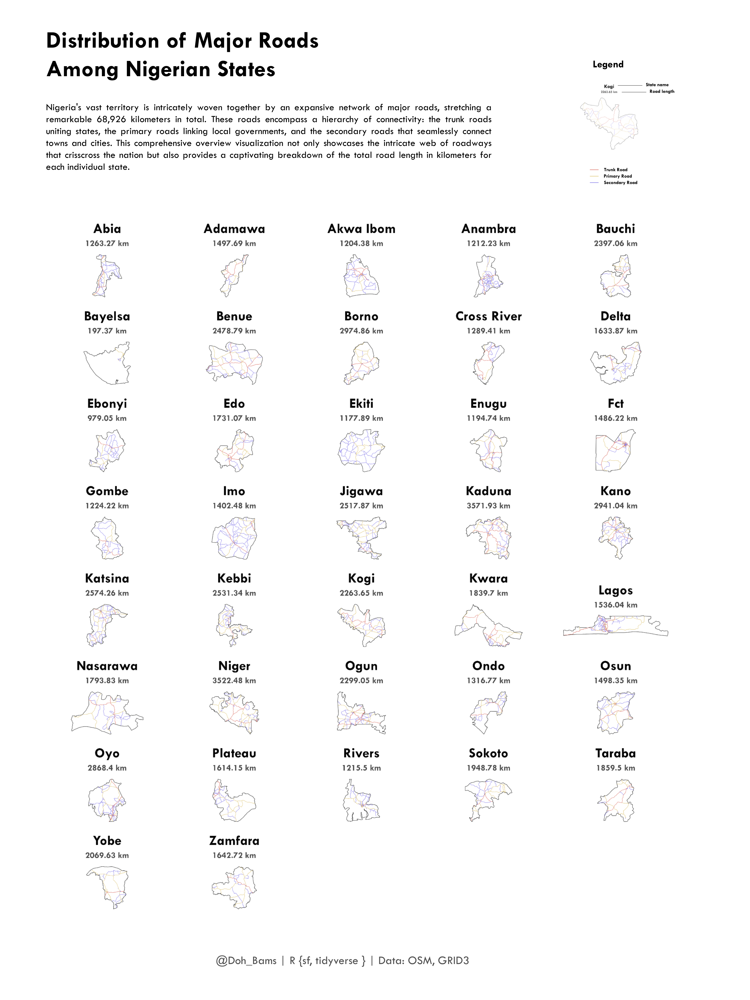

# Major Roads by State in Nigeria

Nigeria's vast territory is intricately woven together by an expansive network of major roads, stretching a remarkable 68,926 kilometers in total. These roads encompass a hierarchy of connectivity: the trunk roads uniting states, the primary roads linking local governments, and the secondary roads that seamlessly connect towns and cities. This comprehensive overview visualization not only showcases the intricate web of roadways that crisscross the nation but also provides a captivating breakdown of the total road length in kilometers for each individual state.

Tools used: R {tidyverse} | PowerPoint.

Data Source: GRID3 | OSM
